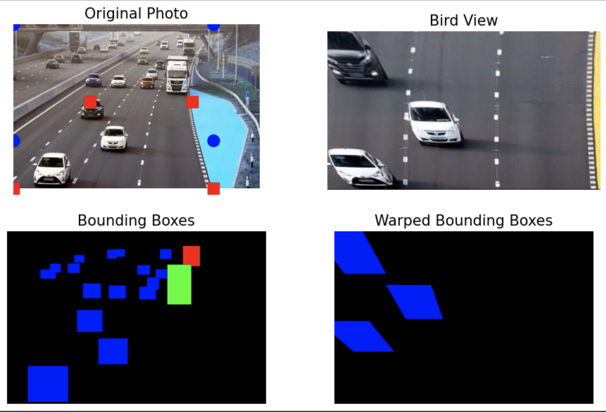
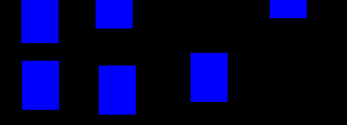
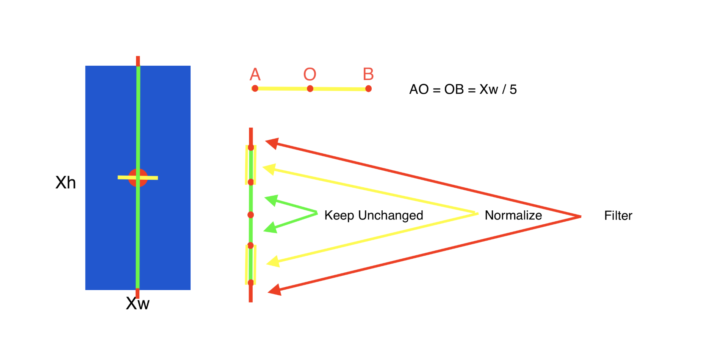
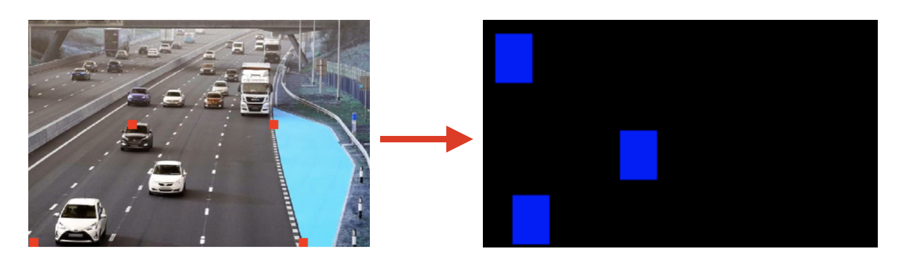
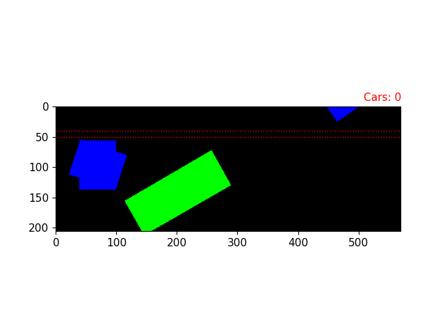

# 🦅 Bird Eye View Transformer

**Bird Eye View Transformer** is a geometric image transformer that transforms a specified region of an image into bird-eye view perspective. 

**Bird Eye View Transformer** solves the problem of data normalization, saves computing resources, helps to extract more information from an image, and facilitates the analytics process.

# 👩🏻‍🔬 Perspective Matrix

# ⚙️ Bird Eye Transformation

# 🧬 Normalization

In order to decrease the effect of model detection inaccuracy, normalization was introduced.

# 🧑🏻‍🏫 Results

Due to lack of computation resourses, I used the YoloV8 nano version -> detected bounding boxes suddenly disappear. As a result, BirdEyeView is unstable in the Gif below.

# 📈 Analytics

**Bird Eye View Transformer** counts the amount of unique cars which were present on specific image region. 

